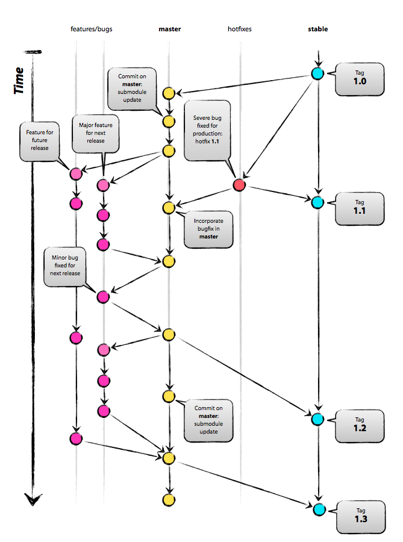

除了简单的动态页面网站以外， PHP被越来越多用于编写中大型项目。随之而来，项目团队需要采用工程化的项目实践来提高开发效率以及降低维护成本、提高项目的成功率。本文对相应的实践做概述性的总结。

## 版本控制
使用git进行版本控制可以方便团队成员进行同步开发。git分支策略能够在保证代码稳定的同时方便新功能的开发。
### 主分支
1. `master`: 下一个发布版本的代码都必须存储在本分支下
2. `stable`: 当前发布了的版本代码
### 支持性分支
1. `性能分支`：从master分支创建，完成后合并到master分支，命名规范为`feature-<tbd number>`
2. `Bug分支`：从master分支创建，完成后合并到master分支，命名规范为`bug-<id>`。修复当前在线代码的bug并在下一次版本发布时包含修复代码时使用。操作命令参考`性能分支`部分。需要把创建本分支以后master分支的更新合并到本分支。
3. `Hotfix分支`：当在线代码需要紧急修复的bug时创建。从stable分支创建，完成后合并到master和stable分支，命名规范为`hotfix-<id>`。


#### 分支操作（以feature分支为例）
```bash
# 开始新的分支
$ git checkout -b feature-id master                 // creates a local branch for the new feature
$ git push origin feature-id                        // makes the new feature remotely available

# 阶段性合并
$ git merge master

# 完成开发
$ git checkout master                               // change to the master branch  
$ git merge --no-ff feature-id                      // makes sure to create a commit object during merge
$ git push origin master                            // push merge changes
$ git push origin :feature-id                       // deletes the remote branch
```

## 依赖管理
使用[composer](https://getcomposer.org/)，进行依赖管理可以实现模块化的开发，并且它也提供了方便使用的[自动加载特性](https://rockysynergy.github.io/Using-Composer/)。

## 性能
性能优化的终极目的是缩短Web应用响应用户操作的时间，提高用户的使用体验。需要根据项目的实际情况指定性能优化策略。
###流程
    1. 压力测试：把被测系统看作一个黑盒，测试并记录系统的响应时间。
    2. 剖析：开发环境使用xdebug，生产环境使用[XHProf](https://tideways.com/profiler/xhprof-for-php7)找到性能瓶颈
    3. 优化：对性能瓶颈部分进行优化。
以上流程应该是一个闭合的过程，迭代递进的进行性能优化会大大提高效率。

###缓存
1. PHP代码是转化成OPCode然后再Zend Engine上运行的，使用[OPCache](http://php.net/manual/en/intro.opcache.php)可以把Opcode保存在内存，这样就不用每次请求都重新解析PHP代码了。
2. 使用`Redis`把Session以及数据库查询结果缓存在内存避免每次请求都从数据库或文件系统读取数据。

###配置
对nginx、MySql服务器以及PHP进行配置也可以提高系统的响应速度。

###代码优化
1. mysql优化，包括数据库设计、索引建立以及查询优化以及其它高级优化。
2. 算法优化

## 代码规范
无论是团队开发还是个人项目都需要有代码规范

## 测试
1. 单元测试：粒度最小的测试
2. 集成测试：测试模块之间的合成
3. 界面测试